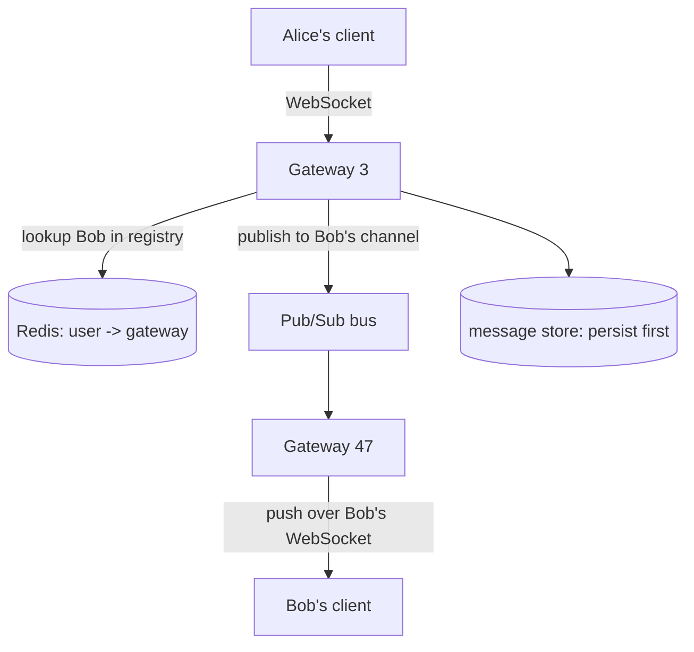

# Design a Chat System

> Sending a message to a friend who's online *right now* means a server must push to a specific open connection — possibly on a different machine. Real-time delivery across a fleet is the heart of chat design.

**Type:** Capstone
**Languages:** Markdown
**Prerequisites:** Phases 0–7 (esp. Phase 1 realtime, Phase 6 messaging)
**Time:** ~60 minutes

## Learning Objectives

- Apply the design framework to a real-time chat system
- Design persistent WebSocket connections and a connection registry
- Route a message to the right server holding the recipient's socket
- Model message storage, ordering, and delivery/read receipts
- Reason about presence and offline delivery

## The Problem

Chat (WhatsApp, Slack, Messenger) feels simple: type a message, your friend sees it instantly. But "instantly" means *push* — the server must send to the recipient the moment the message arrives, not wait for them to poll (Phase 1). That requires a persistent connection (WebSocket) held open for every online user. With millions of concurrent users, those connections are spread across thousands of servers, and here's the crux: when Alice (connected to server 3) messages Bob (connected to server 47), server 3 must find and deliver to Bob's socket on server 47. Routing a message to the one server holding the recipient's live connection — and handling the recipient being offline, on multiple devices, or in a group of 500 — is what makes chat a genuine design challenge.

## The Concept — applying the framework

### Step 1 — Requirements

**Functional:** 1:1 messaging; group messaging; online/offline **presence**; **delivery + read receipts** ("sent / delivered / read"); message history; offline delivery (messages wait for offline users).
**Out of scope:** voice/video calls, end-to-end encryption details, media beyond a link.
**Non-functional:** **low latency** (messages feel instant, sub-second); **reliable delivery** (never silently lose a message); **ordered** (messages in a conversation arrive in order); millions of **concurrent persistent connections**; mostly **available** (a brief delay beats data loss).

### Step 2 — Estimation

```
~50M concurrent online users -> 50M open WebSocket connections held simultaneously
  -> at ~10K connections/server -> ~5,000 chat gateway servers just for sockets
~50M users x 40 messages/day -> 2B messages/day -> ~25,000 messages/sec average
Storage: 2B msgs/day x ~300 bytes ≈ 600 GB/day of message history
```

The defining number: **50M simultaneous open connections.** Holding and routing across millions of persistent sockets (the Phase 1 WebSocket cost realized) is the central infrastructure problem.

### Step 3 — API / protocol

```
WebSocket (persistent, bidirectional):
  client -> server:  SEND {to, text, client_msg_id}
  server -> client:  MESSAGE {from, text, msg_id, ts}
  server -> client:  RECEIPT {msg_id, status: delivered|read}
REST (non-realtime):
  GET /conversations/{id}/messages?before=...   (history, paginated)
```

The live path is the WebSocket; history is a normal paginated REST read.

### Step 4 — Data model

```
messages:   msg_id (PK, sortable) | conversation_id | sender_id | text | created | status
conversations: conv_id | members[]
connections:  user_id -> {server_id, conn_id, devices[]}   (the routing registry)
```

`messages` is **write-heavy** (every chat line is a write) and queried by conversation in time order — a great fit for a **wide-column store** (Cassandra, Phase 2) partitioned by `conversation_id`, sorted by a time-ordered `msg_id`. The `connections` registry — *who is connected to which server* — is the key to routing and lives in a fast shared store (Redis).

### Step 5 — The core problem: routing to a live connection

A user's WebSocket is held on one specific **chat gateway** server. To deliver a message you must find that server. Two pieces solve it:

1. **Connection registry**: when a user connects, record `user_id → gateway_server_id` in a shared store (Redis). When they disconnect, remove it.
2. **Inter-server routing via pub/sub**: the sender's gateway looks up the recipient's gateway and forwards the message — typically through a **pub/sub** layer (Phase 6) where each gateway subscribes to a channel for its users. This is exactly the "route a message to the right socket across a fleet" problem Phase 1 flagged.



The flow: Alice sends → her gateway **persists** the message (so it's never lost), looks up Bob's gateway, **publishes** the message onto the bus → Bob's gateway receives it and **pushes** it down Bob's WebSocket. If Bob is **offline** (no registry entry), the message is already stored; it's delivered when he reconnects (and a push notification may be sent).

### Step 6 — Ordering, receipts, presence, and the bottleneck

- **Ordering**: messages in a conversation must appear in order. Use a **time-sortable message ID** (e.g. Snowflake, Phase 4/8) and partition the message store by `conversation_id` so a conversation's messages are stored and read in order. Per-conversation ordering is what users actually need (global ordering isn't required — Phase 5).
- **Delivery / read receipts**: model status as `sent → delivered → read`. When Bob's gateway pushes the message, it sends a `delivered` receipt back to Alice; when Bob's client views it, a `read` receipt. These are just small messages routed the same way.
- **Presence**: online/offline derived from connection registry entries plus heartbeats; presence changes fan out to a user's contacts (a pub/sub fan-out, and a real scaling cost for users with many contacts — the Phase 8 feed problem again).
- **Offline delivery**: because the message is **persisted before** delivery, an offline user simply gets it on reconnect — durability first, delivery second.

The **bottleneck** is managing millions of persistent connections and routing between them. The deep-dive resolution is the **gateway + registry + pub/sub** architecture: stateless-ish gateways holding sockets, a shared registry for location, and a pub/sub bus for inter-gateway delivery. Messages are sharded by conversation; the connection layer scales by adding gateways.

### A common misconception

"Just use a database and have clients poll." Polling can't deliver the instant, push feel and wastes enormous resources at this scale (Phase 1) — chat needs persistent push connections. The subtler mistake is forgetting that those connections live on *different servers*, so you can't deliver a message just by writing to a DB; you need the registry + pub/sub to route to the recipient's gateway. Finally, **persist before deliver**: if you push first and store later, a crash mid-delivery loses the message — storing first guarantees offline users and crashes never drop messages, trading a hair of latency for reliability (which the requirements demand).

## Exercises

1. **Trace a message.** Alice (gateway 3) messages Bob (gateway 47). List every step from send to Bob's screen, including persistence and the receipt.

2. **Offline delivery.** Bob is offline when Alice messages him. Show how "persist before deliver" guarantees he gets it on reconnect, and where a push notification fits.

3. **Connection math.** With 50M concurrent users and 10K connections per gateway, how many gateways do you need? What happens to others' deliveries if one gateway crashes?

4. **Ordering.** Explain how a time-sortable message ID plus partitioning by conversation_id gives correct per-conversation order without global ordering.

5. **Group chat fan-out.** A group has 500 members. Describe how a single message reaches all of them, and why a 100,000-member group resembles the celebrity problem (Lesson 03).

## Key Terms

| Term | What people say | What it actually means |
|------|----------------|------------------------|
| Chat gateway | "WebSocket server" | A server holding clients' persistent connections and pushing messages to them |
| Connection registry | "Who's where" | A shared map of user_id → gateway server, used to route messages |
| Pub/sub routing | "Inter-server bus" | Forwarding a message to the gateway holding the recipient via pub/sub (Phase 6) |
| Presence | "Online status" | A user's online/offline state, from connections + heartbeats |
| Delivery receipt | "Sent/delivered/read" | Status updates routed back to the sender as the message progresses |
| Persist before deliver | "Store first" | Writing the message durably before attempting delivery, so nothing is lost |
| Time-sortable ID | "Snowflake ID" | A message ID that sorts by time, giving per-conversation ordering |
| Offline delivery | "Deliver on reconnect" | Holding stored messages for offline users until they return |
