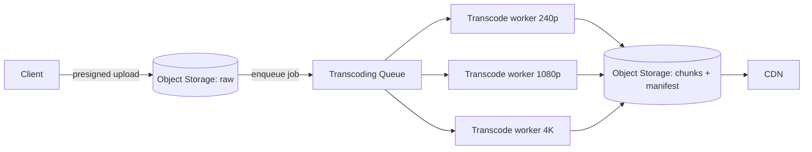

# Design a Video Streaming Platform

> Video is the ultimate stress test of a system: petabytes of storage, terabits of bandwidth, and a single upload that must play smoothly on a phone, a laptop, and a 4K TV — over connections that change second to second.

**Type:** Capstone
**Languages:** Markdown
**Prerequisites:** Phases 0–7 (esp. Phase 2 storage, Phase 3 CDN, Phase 6 async)
**Time:** ~60 minutes

## Learning Objectives

- Apply the design framework to a video platform (YouTube/Netflix-style)
- Design an upload → transcoding pipeline using async processing
- Explain adaptive bitrate streaming and why it exists
- Architect global delivery with CDNs and object storage
- Identify the bottlenecks: storage, bandwidth, and transcoding

## The Problem

A video platform (YouTube, Netflix, Twitch VOD) lets users upload videos and stream them smoothly worldwide. Every constraint is extreme. A single 4K video is gigabytes; the catalog is **petabytes**. Serving millions of concurrent viewers means **terabits per second** of egress — the dominant cost. And the same video must play on a phone on 3G, a laptop on fiber, and a 4K TV, adapting as the network fluctuates mid-playback. None of this works with a naive "store the file, send the bytes" approach. Video forces you to combine object storage (Phase 2), CDNs (Phase 3), and async pipelines (Phase 6) into one system — making it the perfect capstone for everything in this course.

## The Concept — applying the framework

### Step 1 — Requirements

**Functional:** upload a video; transcode it for many devices/qualities; stream it with smooth playback that adapts to bandwidth; (optional) view counts, recommendations.
**Out of scope:** live streaming (we'll do video-on-demand), DRM specifics, the recommendation algorithm, comments.
**Non-functional:** **massively read-heavy** (one upload, millions of views); **smooth playback** (no buffering — quality adapts instead); **global low latency** (viewers everywhere); **huge storage** (petabytes) and **huge bandwidth** (the main cost); uploads can be **slow/async** (processing in the background is fine).

### Step 2 — Estimation

```
Uploads:  ~500 hours of video/minute (YouTube-scale) -> enormous ingest
Storage:  raw + every transcoded rendition. A 1-hour 1080p video ~3 GB;
          x ~6 renditions x billions of videos -> EXABYTES. Object storage only.
Delivery: 1B hours watched/day; at ~5 Mbps avg -> tens of Tbps of egress at peak.
          Bandwidth, not compute, is the dominant cost -> CDN is mandatory.
```

Two headline numbers: storage is **petabytes-to-exabytes** (object storage, not a database) and delivery is **tens of terabits/sec** (a CDN, or you go bankrupt on origin bandwidth).

### Step 3 — API / flow

```
POST /upload         -> presigned URL (Phase 2); client uploads bytes directly
(async) transcoding pipeline produces renditions + a manifest
GET  /watch/{id}     -> returns a manifest URL (e.g. .m3u8 / DASH)
player fetches the manifest, then pulls video CHUNKS from the CDN, adapting quality
```

### Step 4 — Data model

```
videos:   video_id (PK) | uploader | title | status(processing|ready) | duration
renditions: video_id | quality(240p..4k) | codec | manifest_url | chunk_urls
Video BYTES: in OBJECT STORAGE (S3), fronted by a CDN. NOT in a database.
Metadata: in a regular DB (small, queryable). Blobs: object storage (Phase 2).
```

The split from Phase 2 is essential: tiny queryable metadata in a database, gigantic video blobs in object storage behind a CDN.

### Step 5 — Two cores: the transcoding pipeline and adaptive streaming

**(a) Upload → transcoding pipeline (async, Phase 6).** A raw upload can't be served directly — it must be converted into multiple **renditions** (resolutions/bitrates: 240p, 480p, 720p, 1080p, 4K) and split into small **chunks** (a few seconds each). This is heavy, slow work, so it's done asynchronously:



The client uploads to object storage via a presigned URL (Phase 2); that drops a job on a **queue** (Phase 6); a fleet of transcoding **workers** (scaled horizontally) produces every rendition and chunks them, writing results back to object storage; the CDN serves them. The video's status flips `processing → ready` when done. This is async processing and worker pools (Phase 6) applied to CPU-heavy media work.

**(b) Adaptive bitrate streaming (ABR).** Instead of one file, the player is given a **manifest** listing the same video at multiple qualities, each cut into time-aligned chunks. The player downloads chunk by chunk and **picks the quality per chunk based on current bandwidth** — dropping to 480p when the network slows, climbing to 1080p when it recovers — all without interrupting playback.

```
Manifest (HLS/DASH):
  240p:  [chunk0][chunk1][chunk2]...   (small, low bandwidth)
  720p:  [chunk0][chunk1][chunk2]...
  1080p: [chunk0][chunk1][chunk2]...   (large, high bandwidth)
Player picks per-chunk: ...720p, 720p, [network drops] 480p, 480p, [recovers] 720p...
```

This is why streaming video rarely "buffers" anymore — it degrades *quality* instead of *stopping*. Chunking + multiple renditions + a smart client = smooth playback over a changing network.

### Step 6 — Delivery and the bottlenecks

The chunks are static, identical for all viewers, and enormous in aggregate — a textbook **CDN** case (Phase 3). The CDN caches chunks at edge locations worldwide; a popular video's chunks live in edge caches near viewers, so the vast majority of bytes are served from the edge, never touching your origin. Object storage is the **origin** (Phase 2); the CDN offloads the terabits of egress.

The three bottlenecks and their resolutions:

```
Bottleneck    Why                                  Resolution
------------  -----------------------------------  ------------------------------
Bandwidth     tens of Tbps egress; the #1 cost     CDN (serve chunks from edge)
Storage       petabytes/exabytes of renditions     object storage (S3), tiered
Transcoding   CPU-heavy, slow, per-upload          async queue + worker fleet
```

Everything composes: presigned uploads + object storage (Phase 2), async transcoding queue + workers (Phase 6), CDN edge delivery (Phase 3), metadata DB (Phase 2), all sized from estimation (Phase 0). The video platform is the course in one system.

### A common misconception

"Just store the video file and stream it to everyone." This fails three ways: you can't serve one fixed quality to wildly different devices/networks (you need renditions + ABR); you can't serve petabytes of egress from your origin (you need a CDN); and you can't transcode synchronously during upload (you need an async pipeline). The other misconception is putting video bytes in a database — they belong in object storage behind a CDN, with only metadata in the DB (Phase 2). Finally, the dominant cost is **bandwidth**, not storage or compute, so the CDN isn't an optimization — it's the load-bearing decision that makes the economics work at all.

## Exercises

1. **Trace an upload.** Walk a video from "user hits upload" to "ready to watch," naming the presigned URL, queue, workers, renditions, and status flip.

2. **Adaptive bitrate.** A viewer's bandwidth drops mid-video. Explain exactly how ABR keeps playback smooth, and why this beats a single fixed-quality file.

3. **Bandwidth math.** 1M concurrent viewers at 5 Mbps each — what's the aggregate egress? Why does serving this from origin (vs CDN) determine whether the business survives?

4. **Storage split.** Justify storing video bytes in object storage and metadata in a database. What goes wrong if you put the video in the DB?

5. **Transcoding scale.** Why must transcoding be async with a worker fleet rather than done inline during upload? What queues up if uploads spike?

## Key Terms

| Term | What people say | What it actually means |
|------|----------------|------------------------|
| Transcoding | "Convert the video" | Producing multiple resolution/bitrate renditions from one upload |
| Rendition | "A quality version" | One resolution/bitrate variant of a video (240p…4K) |
| Chunk / segment | "Video piece" | A few-seconds slice of a rendition, fetched independently |
| Adaptive bitrate (ABR) | "Auto quality" | The player picks quality per chunk based on current bandwidth |
| Manifest | "Playlist (HLS/DASH)" | The file listing renditions and chunks the player reads |
| Transcoding pipeline | "Processing queue" | Async queue + worker fleet that produces renditions after upload |
| Origin | "Source of bytes" | The object store the CDN pulls chunks from on a miss |
| Egress | "Outbound bandwidth" | Data sent to viewers; the dominant cost, offloaded by the CDN |
