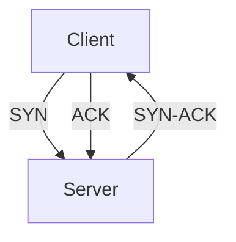

# generate-course

You are generating a self-contained course entry for a multi-course learning site.

## What you must produce

`site/courses/<slug>/` containing:

| File | Required | Description |
|---|---|---|
| `data.json` | ✅ | Course metadata, phases, lessons, glossary |
| `phases/<phase>/<lesson>/docs/en.md` | ✅ | Full lesson content for every lesson |
| `phases/<phase>/<lesson>/quiz.json` | ✅ | 2 pre + 3 post quiz questions per lesson |
| `phases/<phase>/<lesson>/code/` | ✅ | Runnable starter/reference code files |
| `phases/<phase>/<lesson>/outputs/` | recommended | Expected output samples so learners can verify their work |

After writing all files, run:
```bash
node site/combine.js
```

### Reference structure

```
site/courses/
  ai-engineering/          ← reference course
    data.json
    phases/
      00-setup-and-tooling/
        01-dev-environment/
          docs/en.md
          quiz.json
          code/
            verify.py
            verify.ts
          outputs/
            prompt-env-check.md
  <new-slug>/
    data.json
    phases/
      00-foundations/
        01-first-lesson/
          docs/en.md
          quiz.json
          code/
            main.<ext>
          outputs/
            expected-output.md
```

---

## Input you need from the user

| Field | Required | Example |
|---|---|---|
| Subject / title | ✅ | "Python from Scratch" |
| Slug (URL-safe) | ✅ | `python` |
| GitHub repo | ✅ | `user/python-from-scratch` |
| GitHub branch | optional | `main` (default) |
| Tagline | optional | auto-generate |
| Description | optional | auto-generate |

---

## data.json schema

```jsonc
{
  "slug": "python",
  "title": "Python from Scratch",
  "tagline": "N lessons. N phases. ...",
  "description": "1-2 sentences, no buzzwords.",
  "githubRepo": "user/repo",
  "githubBranch": "main",
  "contentHost": "local",   // ALWAYS "local" — you are writing the files
  "phases": [],
  "glossary": [],
  "artifacts": [],
  "prereqs": {              // ✅ REQUIRED — drives the roadmap graph
    "0": [],
    "1": [0],
    "2": [1]
    // string keys, integer array values; one entry per phase id
  },
  "tierOrder": [            // ✅ REQUIRED — controls roadmap row layout
    [0],
    [1],
    [2]
    // each sub-array is one horizontal row; parallel phases share a row
  ]
}
```

### prereqs rules
- Every phase id must have an entry, even if `[]`
- Phase 0 always has `[]`
- Think about actual knowledge dependencies

### tierOrder rules
- Phases with no prerequisites → tier 0
- Parallel tracks (e.g. two phases that both depend on phase 2) → same row
- Final capstone → its own last row

### Phase schema

```jsonc
{
  "id": 0,
  "name": "Foundations",
  "status": "complete",      // "complete" | "in-progress" | "planned"
  "desc": "One sentence about the outcome.",
  "lessons": []
}
```

### Lesson schema

```jsonc
{
  "name": "Variables & Types",
  "status": "complete",
  "type": "Build",           // "Build" | "Learn" | "Capstone" | "Project"
  "lang": "Python",
  "url": "https://github.com/{repo}/tree/{branch}/phases/{phase-slug}/{lesson-slug}/",
  "path": "phases/{course-slug}/{phase-slug}/{lesson-slug}",
  "summary": "One concrete sentence: what the student builds or proves.",
  "keywords": "keyword1 · keyword2 · keyword3"
}
```

**Path rules:**
- Phase slugs: `{id:02d}-{kebab-name}` → `00-foundations`
- Lesson slugs: `{index:02d}-{kebab-name}` → `01-variables-and-types`
- `path` format: `phases/{course-slug}/{phase-slug}/{lesson-slug}`
- All lessons must have both `url` and `path`

### Glossary schema

```jsonc
{ "term": "Decorator", "says": "casual shorthand", "means": "precise 1-2 sentence definition" }
```

---

## docs/en.md schema

```markdown
# <Lesson Name>

> <One-line hook — a concrete claim or question that motivates this lesson.>

**Type:** Build | Learn | Capstone  
**Languages:** Python, Bash, etc.  
**Prerequisites:** Phase N, Lesson NN — <name>  
**Time:** ~XX minutes  

## Learning Objectives

- 3–5 bullets, each starting with an action verb: Implement, Write, Explain, Build, Trace, Measure

## The Problem

2–4 paragraphs: WHY this matters, what breaks without it. Concrete scenario. No buzzwords.

## The Concept

Thorough explanation of the underlying concept. Include:
- ASCII diagrams or Mermaid diagrams for anything spatial (packet layouts, state machines, topologies, flows)
- The mental model needed
- Common misconceptions called out explicitly

Use Mermaid for diagrams wherever it adds clarity:



Illustrative code blocks (not the exercise yet):

```language
# Annotated example showing the idea
```

## Build It

Step-by-step. Each step:
1. What to do (imperative)
2. The code or command — complete, no ellipsis
3. What to observe / verify

Every code block must be full and runnable. "From scratch" means explain every line.

## Exercises

3–5 numbered exercises: start with verification (run this, see that), end with extension (modify it to do X).

## Key Terms

| Term | What people say | What it actually means |
|------|-----------------|------------------------|
```

**Quality bar:**
- No lesson under 600 words
- Every code block complete and runnable
- Diagrams (ASCII or Mermaid) for anything spatial
- No buzzwords: "powerful", "robust", "seamless", "revolutionary"

---

## code/ files

Every lesson must have a `code/` directory with at least one runnable file.

Rules:
- Name files descriptively: `tcp_handshake.py`, `hello.rs`, `server.go`
- The file must run without modification after following the lesson's Build It steps
- Include only the language(s) listed in the lesson's `lang` field
- Add a one-line comment at the top: `# Run: python tcp_handshake.py`
- For multi-step lessons, provide the final working version

Example for a Python lesson:
```python
# Run: python variables.py
name = "Alice"
age = 30
pi = 3.14159
is_student = False

print(f"{name} is {age} years old")
print(f"Pi is approximately {pi}")
print(f"Is student: {is_student}")
```

---

## outputs/ files

Include an `outputs/` directory when the lesson produces observable output that learners should verify.

Write `outputs/expected.md` with:
```markdown
# Expected Output

Running `python variables.py` should produce:

```
Alice is 30 years old
Pi is approximately 3.14159
Is student: False
```

If your output matches, you're good. Common issues:
- [list 1–2 things that typically go wrong and how to fix them]
```

Skip `outputs/` only for purely conceptual lessons with no runnable artifact.

---

## quiz.json schema

```jsonc
{
  "questions": [
    { "stage": "pre",  "question": "...", "options": ["A","B","C","D"], "correct": 1, "explanation": "..." },
    { "stage": "pre",  "question": "...", "options": ["A","B","C","D"], "correct": 0, "explanation": "..." },
    { "stage": "post", "question": "...", "options": ["A","B","C","D"], "correct": 2, "explanation": "..." },
    { "stage": "post", "question": "...", "options": ["A","B","C","D"], "correct": 1, "explanation": "..." },
    { "stage": "post", "question": "...", "options": ["A","B","C","D"], "correct": 3, "explanation": "..." }
  ]
}
```

Rules:
- 2 `pre` + 3 `post` = 5 questions per lesson
- `pre`: test baseline assumptions — wrong answers should be common misconceptions
- `post`: directly testable from the lesson content
- `explanation`: teaches, not just confirms — "Correct. TCP does X because Y."
- Distractors must be plausible

---

## Content generation guidelines

### Structure
- **8–12 phases** for most subjects
- **4–8 lessons per phase**
- Phase 0: always "Foundations" — tooling, environment, first runnable program
- Final phase: always Capstone with 3–5 real projects
- Status: early phases `complete`, middle `in-progress`, later `planned`
- **Write content for ALL lessons regardless of status**

### Quality bar
- Lesson names are action-oriented: "Build a ...", "Implement ...", "Write ..."
- Every `summary` is one concrete sentence
- Glossary: 20–50 terms
- No marketing language

### Diagrams
- Use **Mermaid** for: flowcharts, state machines, sequence diagrams, dependency graphs
- Use **ASCII** for: packet layouts, memory layouts, tree/stack structures, byte-level diagrams
- Every phase should have at least one diagram somewhere in its lessons

### Subject-specific guidance
- **Networking**: packet diagrams for every protocol, ASCII topology, explain every header field
- **Systems/low-level (Rust, C, Zig)**: memory diagrams, ownership flow, unsafe boundaries
- **ML/AI**: math-first, implement before framework, track loss curves in outputs/
- **Web/full-stack**: deployable projects, progressive disclosure
- **Scripting (Python, bash)**: practical tasks, real files and processes

---

## Execution — phase-by-phase with checkpointing

Large courses span many files. **Commit after each phase** so progress survives context limits.

### Step 1: Clarify inputs
Collect slug, repo, title. Confirm the phase outline with the user before writing anything.

### Step 2: Write data.json
Write `site/courses/<slug>/data.json` with the full structure: all phases, all lessons, glossary, `prereqs`, `tierOrder`.

Commit:
```bash
git add site/courses/<slug>/data.json
git commit -m "feat(<slug>): scaffold course structure"
```

### Step 3: Generate phases one at a time

For each phase (starting at phase 0):

1. Write every lesson's `docs/en.md`, `quiz.json`, `code/`, and `outputs/` for this phase
2. Run a quick self-check (see Validation below)
3. Commit the phase:

```bash
git add site/courses/<slug>/phases/<phase-slug>/
git commit -m "feat(<slug>): write phase <N> — <phase name>"
```

Do not move to the next phase until the current one is committed.

### Step 4: Rebuild and validate

After all phases are written:

```bash
node site/combine.js
```

**Validation checklist** — run these checks before reporting done:

```bash
# 1. Every path in data.json has a docs/en.md
node -e "
const d = require('./site/courses/<slug>/data.json');
const fs = require('fs');
let missing = [];
d.phases.forEach(p => p.lessons.forEach(l => {
  if (!l.path) { missing.push(l.name + ': missing path'); return; }
  const seg = l.path.split('/');
  const f = 'site/courses/' + seg[1] + '/phases/' + seg[2] + '/' + seg[3] + '/docs/en.md';
  if (!fs.existsSync(f)) missing.push(f);
}));
if (missing.length) { console.error('MISSING:', missing); process.exit(1); }
else console.log('All docs/en.md present');
"

# 2. Every path has a quiz.json
node -e "
const d = require('./site/courses/<slug>/data.json');
const fs = require('fs');
let missing = [];
d.phases.forEach(p => p.lessons.forEach(l => {
  if (!l.path) return;
  const seg = l.path.split('/');
  const f = 'site/courses/' + seg[1] + '/phases/' + seg[2] + '/' + seg[3] + '/quiz.json';
  if (!fs.existsSync(f)) missing.push(f);
}));
if (missing.length) { console.error('MISSING:', missing); process.exit(1); }
else console.log('All quiz.json present');
"

# 3. Every path has at least one code file
node -e "
const d = require('./site/courses/<slug>/data.json');
const fs = require('fs');
let missing = [];
d.phases.forEach(p => p.lessons.forEach(l => {
  if (!l.path) return;
  const seg = l.path.split('/');
  const dir = 'site/courses/' + seg[1] + '/phases/' + seg[2] + '/' + seg[3] + '/code';
  if (!fs.existsSync(dir) || fs.readdirSync(dir).length === 0) missing.push(dir);
}));
if (missing.length) { console.error('MISSING code/:', missing); process.exit(1); }
else console.log('All code/ dirs present');
"
```

If any check fails, fix the missing files before continuing.

### Step 5: Update README.md

Update the course table in `README.md` to include the new course:

```markdown
| <Title> | <N phases> | <N lessons> |
```

Commit everything:
```bash
git add site/data.js README.md
git commit -m "feat(<slug>): complete course — N phases, N lessons"
```

### Step 6: Report

Tell the user:
- Slug, title, phase count, lesson count
- Any lessons that were skipped or placeholder-only (there should be none)
- The git log showing each phase commit

---

## Example invocation

> Generate a course for "TypeScript from Scratch". Slug: `typescript`, repo: `user/typescript-from-scratch`.

You would:
1. Confirm: 9 phases, ~45 lessons
2. Write `data.json`, commit
3. Write phase 0 (Tooling & Setup) — all docs/en.md + quiz.json + code/ + outputs/, commit
4. Write phase 1 (Types & Interfaces), commit
5. ... repeat through phase 8 (Capstone)
6. Run validation, fix any gaps
7. Rebuild data.js, update README, final commit
